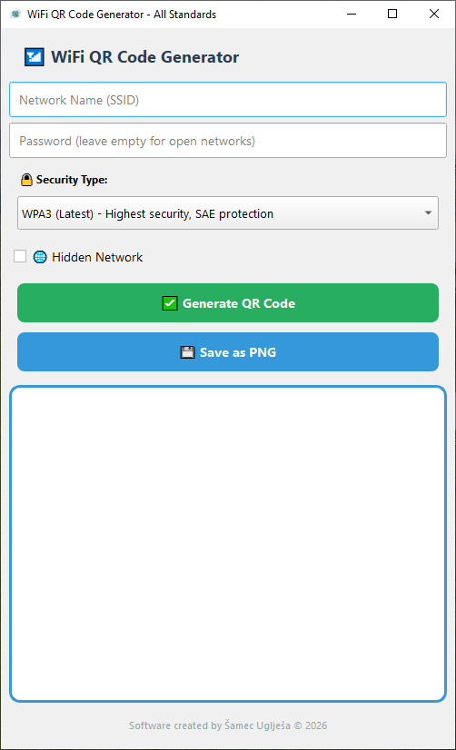

# WiFi QR Code Generator 📶  
### Version 1.0 – Local • Secure • Network Utility

<p align="center">


</p>

---

## 🛡 About the Project

**WiFi QR Code Generator** is a lightweight desktop application that allows users to generate QR codes for wireless networks.

Instead of manually typing long passwords, users can simply **scan the QR code with a smartphone and connect instantly**.

The application supports modern WiFi security standards including **WPA3 and WPA2**, and allows saving QR codes as image files.

Key characteristics:

- 100% **offline application**
- **Modern GUI built with PyQt6**
- Generates QR codes following the **official WiFi QR standard**
- Supports **hidden networks**
- Export QR codes as **PNG images**

---

## 🎯 Intended For

- 👤 Home users who want easy WiFi sharing  
- 🏨 Hotels, cafes, and public spaces  
- 🏢 Office environments  
- 🧑‍💻 IT administrators  
- 📡 Anyone who wants quick wireless network access via QR

---

## 🚀 Features

| Feature | Description |
|--------|-------------|
| **WiFi QR Generation** | Create QR codes for wireless networks |
| **Multiple Security Standards** | Supports WPA3, WPA2, WPA, WEP, and open networks |
| **Hidden Network Support** | Generate QR codes for hidden SSIDs |
| **PNG Export** | Save QR code as a PNG image |
| **Instant Display** | QR code appears immediately after generation |
| **Secure Offline Operation** | No network communication required |
| **Modern UI** | Clean interface built with PyQt6 |
| **Cross-platform** | Works on Windows, Linux, and macOS |

---

## ⌨️ Controls & Interface

| Control | Function |
|-------|--------|
| **Network Name (SSID)** | Enter WiFi network name |
| **Password Field** | Enter network password |
| **Security Type Dropdown** | Select WPA3 / WPA2 / WPA / WEP / Open |
| **Hidden Network Checkbox** | Enable if network SSID is hidden |
| **Generate QR Code Button** | Creates the WiFi QR code |
| **Save as PNG Button** | Saves QR image to disk |
| **QR Display Panel** | Shows the generated QR code |

---

## ⚙️ Technologies & Dependencies

- Python **3.10+**
- PyQt6 – graphical user interface
- qrcode – QR code generator
- Pillow – image processing library

Install dependencies:


pip install PyQt6 qrcode pillow


📷 Screenshot




## 🛠 Project Structure
```
text-to-audio/
│
├─ app.py # Main application        # Main application
├─ desktop.py # Main application    # First version
├─ app _withouth_text_limitation.py # Main application
├─ ico.ico # Window icon (optional)
├─ requirements.txt # Dependencies
└─ README.md # This file
```

---

## 🔄 Application Workflow

1. Launch the application  
2. Enter **WiFi Network Name (SSID)**  
3. Enter **password** *(leave empty for open networks)*  
4. Select **security type**  
5. Optionally enable **hidden network**  
6. Click **Generate QR Code**  
7. Scan the QR code with a smartphone  
8. Optionally save the QR code as **PNG**

---

## 📡 WiFi QR Code Standard

The application follows the **official WiFi QR code format** supported by Android and iOS devices.

## 📡 WiFi QR Code Standard

| Type | Value |
|-----|------|
| **Format** | `WIFI:S:<SSID>;T:<SECURITY>;P:<PASSWORD>;H:<HIDDEN>;;` |
| **Example** | `WIFI:S:OfficeWiFi;T:WPA2;P:SecurePassword123;H:false;;` |

Scanning the QR code automatically prompts the device to connect.

## 🧩 Common Issues & Solutions

| Issue | Solution |
|------|---------|
| QR code not generated | Make sure the SSID field is filled |
| Image cannot be saved | Check write permissions for the selected folder |
| Application does not start | Ensure PyQt6, qrcode, and Pillow are installed |

---

## ⚙️ Future Improvements

Planned enhancements:

- Custom QR colors  
- Logo inside QR code  
- Bulk QR generation  
- PDF export  
- SVG high-resolution export  
- WiFi auto-detection  

---

## 🏆 Unique Values

- Simple and intuitive interface  
- Supports **latest WiFi standards (WPA3)**  
- **100% local** – no internet required  
- Fast QR generation  
- Suitable for **home, business, and IT environments**

---

## 👨‍💻 Author

Software created by  
**Šamec Uglješa © 2026**

---

## 📜 License

This project is released under the **GPLv3 license**.

If you modify or redistribute this software, you must:

- Provide attribution  
- Publish modifications under the same license.
